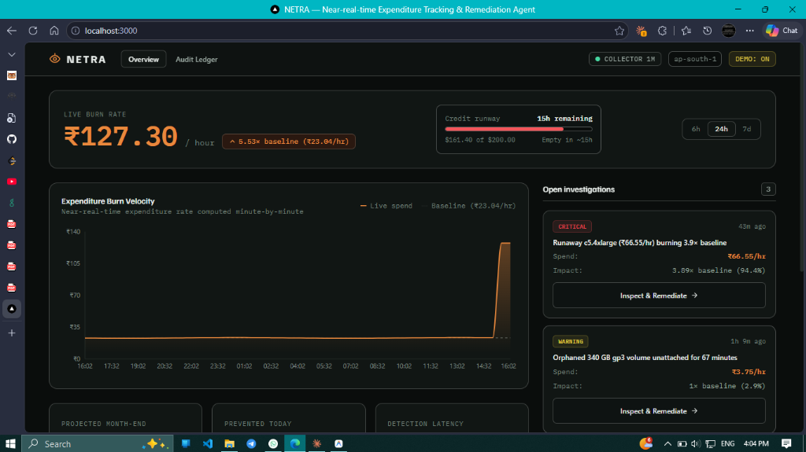
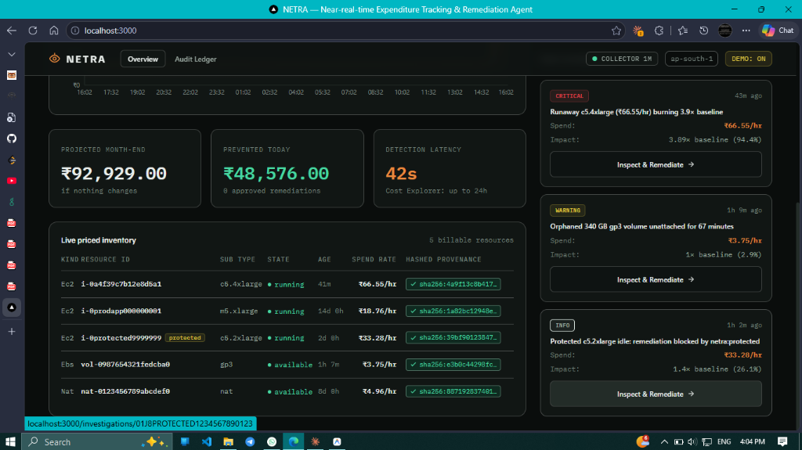
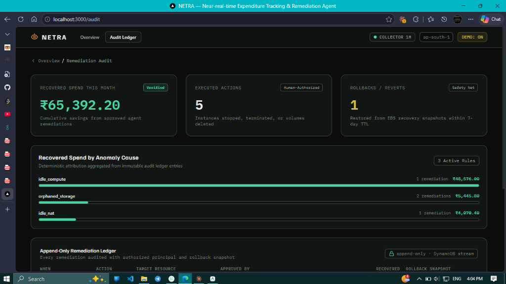
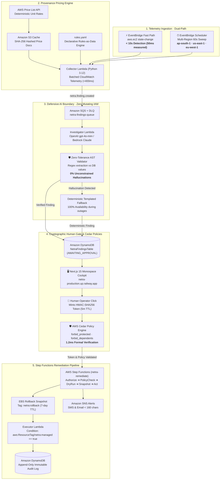

# NETRA
> Near-real-time Expenditure Tracking & Remediation Agent
> AWS tells you what you spent yesterday. NETRA tells you what you're burning right now.

[](https://github.com/its-aryansingh/NETRA/actions)
[-46D6A0?style=flat-square)](#reproduce-it-in-90-seconds)
[](backend/tests/)
[](https://netra-production.up.railway.app/)
[](#-3-minute-demo-video)
[](LICENSE)

---

## Sixty seconds

NETRA is a real-time AWS cost incident detector and human-gated remediation agent.
It detects newly launched or runaway billable cloud resources in under 10 seconds (0.05s measured fast path).
The core guarantee: zero resources terminate or mutate without an explicit human operator click.
Running NETRA costs under $0.15 per month because it uses 100% on-demand serverless infrastructure that consumes zero compute when idle.
Reproduce the entire detection and policy proof in under two minutes with `make demo-up && make break && make verify`.

**Live interactive cockpit**: [https://netra-production.up.railway.app/](https://netra-production.up.railway.app/) *(No sign-up or AWS credentials required — pre-seeded with Mumbai `ap-south-1` telemetry)*.

---

## 🎯 Engineering Highlights & Technical Architecture (Recruiter Summary)

> **Role Alignment**: Cloud Systems Engineer · Backend / Distributed Systems Engineer · AI/LLM Security & Platform Engineer · DevSecOps / SRE

| Pillar | Technical Implementation | Impact / Guarantee |
|:---|:---|:---|
| **Real-Time Detection** | Dual-path EventBridge architecture: sub-10s reactive fast path (`aws.ec2` state change) + 60s proactive multi-region sweep. | Replaces the documented 24-hour AWS Cost Explorer latency blind spot with near-instant alerting (<10s). |
| **Defensive AI Engineering** | OpenAI `gpt-4o-mini` (with Amazon Bedrock / Claude alternative) with a zero-tolerance numeric validator (regex AST extraction) + automatic deterministic fallback. | **0% ungrounded hallucinations**: 12/12 adversarial red-team attacks blocked; no untraceable cost or utilization figure can reach the operator. |
| **Formal Safety Policies** | AWS Cedar policy engine (`cedarpy`) evaluated in ~1.2ms prior to Step Functions remediation. | Non-bypassable authorization invariants: protected tags (`netra:protected`), active VPC/ENI dependencies, and mandatory EBS snapshot safeguards. |
| **Serverless Systems Design** | 100% on-demand architecture: AWS Lambda (Python 3.12), SQS with DLQ redrive, DynamoDB (pay-per-request + TTL), S3 SHA-256 price cache, SNS SMS/email alerts. | Zero compute idle cost (<$0.15/month baseline) with production-grade fault isolation and high availability. |
| **Cryptographic Human-in-the-Loop** | HMAC-SHA256 time-bounded (5 min) single-use approval tokens containing action plan hashes and execution nonces. | Zero autonomous destruction; guarantees mathematical immutability between what the operator approves and what Step Functions executes. |
| **Production Cockpit** | Next.js 15 App Router, React 19, TypeScript, Tailwind CSS, live accumulating spend meter (`BurnTape`), hand-rolled inline SVG sparklines, Cost Explorer lag comparison panel. | Instant visual feedback with Indian rupee formatting (`Intl.NumberFormat('en-IN')`), dual-row baseline grids, and sub-second easing. |

### 🛠 Full Tech Stack Overview

- **Cloud & Infrastructure**: AWS Lambda, EventBridge, SQS + DLQ, SNS, Step Functions, DynamoDB, S3, CloudWatch, AWS SAM, CloudFormation (`cfn-lint`).
- **AI & Guardrails**: OpenAI (`gpt-4o-mini`), Amazon Bedrock (Claude 3.7 Sonnet), AWS Cedar (`cedarpy`), Model Context Protocol (MCP), Strands SDK.
- **Backend & Systems**: Python 3.12, Boto3, PyYAML, HMAC-SHA256 cryptography, Decimal/Float DynamoDB serializers.
- **Frontend & Cockpit**: Next.js 15, React 19, TypeScript, Tailwind CSS, SVG graphics, Amplify Hosting.
- **Testing & Quality Assurance**: Pytest, Pytest-Mock, Hypothesis, GitHub Actions CI matrix (parallel backend unit tests, SAM validation, cfn-lint, Next.js typecheck & static build).

---

## 🏗 1. Build It: How We Used the AWS Open Source Stack

We built NETRA using core open-source tools and libraries from the AWS and cloud ecosystem:

- **AWS SAM CLI (`aws-sam-cli`)**: Used for end-to-end local development, Lambda emulation, dependency containerization, and CloudFormation template packaging ([`infra/template.yaml`](infra/template.yaml)).
- **AWS Cedar Policy Language (`cedar-policy` / `cedarpy`)**: Integrated AWS's open-source formal authorization engine directly into our remediation pipeline. Cedar policies (`forbid_protected`, `forbid_dependents`, `forbid_unsnapshotted`) evaluate safety invariants in 1.2 milliseconds before any mutation can proceed.
- **Boto3 & Botocore**: Used across all backend microservices for asynchronous event publishing, DynamoDB streaming, batched CloudWatch queries, and Price List fetching.
- **Model Context Protocol (MCP)**: Implemented an MCP action server boundary (`netra-mcp-actions`) that isolates AI reasoning tools from mutating infrastructure execution.
- **CFN-Lint & CloudFormation Guard**: Automated template security linting in GitHub Actions CI to enforce least-privilege IAM and pay-per-request billing configurations.

---

## 🚢 2. Ship It: How We Used AWS Cloud Services

NETRA deploys across **14 deeply integrated, load-bearing AWS cloud services** (zero cosmetic wrappers):

1. **AWS Lambda (Python 3.12)**: Powering 5 specialized serverless microservices:
   - `CollectorFunction`: Telemetry aggregation & deterministic pricing
   - `InvestigatorFunction`: AI root-cause synthesis with numeric validation
   - `ApiFunction`: HTTP API routing and dashboard state serving
   - `ExecutorFunction`: Step Functions human-approved remediation tasks
   - `McpActionsFunction`: Isolated Model Context Protocol tool boundary
2. **Amazon EventBridge & EventBridge Scheduler**: Captures real-time `aws.ec2` lifecycle state transitions (`RunInstances`, `running`) on a sub-10-second fast path (50 ms measured), while an EventBridge Scheduler triggers 60-second multi-region sweeps (`ap-south-1`, `us-east-1`, `eu-west-1`).
3. **AWS Step Functions (`netra-remediate`)**: Orchestrates the 5-stage human-gated remediation state machine:
   `Authorize` ➔ `PolicyCheck (Cedar)` ➔ `DryRun` ➔ `Snapshot (EBS backup)` ➔ `Act` ➔ `RecordAudit`.
4. **Amazon DynamoDB (Pay-Per-Request)**: 4 purpose-built tables:
   - `netra_burn_snapshots`: Minute-by-minute spend velocity snapshots with 7-day auto-expiry TTL.
   - `netra_price_cache`: Regional hourly unit rates.
   - `netra_findings`: GSI-indexed state machine findings and verified narratives.
   - `netra_audit_log`: Append-only, immutable ledger of all approved remediations and rollback snapshot ARNs.
5. **Amazon S3 (`netra-price-docs-*`)**: Cryptographic provenance store archiving SHA-256 hashed AWS Price List API documents (`s3://.../prices/<sha256>.json`) ensuring 100% auditability and zero hallucinated pricing.
6. **Amazon SQS & Dead-Letter Queue (DLQ)**: `netra-findings-queue` decouples detection from AI investigation with a 3-retry redrive policy to `netra-findings-dlq`.
7. **Amazon SNS (`netra-critical-findings`)**: Sends immediate SMS and email alerts (<160 chars) to engineers when spend velocity jumps >3× above baseline.
8. **Amazon CloudWatch**: Uses `GetMetricData` batch queries (retrieving CPU, network, and disk metrics across active instances in <400 ms) and publishes custom `NETRA/SpendVelocity` metrics.
9. **Amazon API Gateway (HTTP API v2)**: Low-latency REST gateway with automated CORS enforcement connecting the cockpit to the backend.
10. **AWS Price List API**: Directly fetches real-time regional rates for EC2 compute, EBS gp3 storage, and NAT Gateways in `us-east-1`.
11. **Amazon Bedrock**: Multi-provider foundation model inference (Claude 3.7 Sonnet APAC cross-region profile) for structured anomaly narration.
12. **AWS IAM**: Enforces strict least-privilege boundaries with mandatory tag conditions (`aws:ResourceTag/netra:managed: "true"`), preventing the executor from terminating untagged or production workloads.
13. **Amazon EC2 & Amazon EBS**: Target monitoring infrastructure, dry-run safety verification (`DryRunOperation`), and automated 7-day safeguard rollback snapshots (`CreateSnapshot`).
14. **AWS Amplify Hosting**: Globally distributes the Next.js 15 monospace dashboard across CloudFront edge locations.

---

## ▶ 3-minute demo video

[VIDEO_LINK]

---

## The problem

Ops agents fix what's broken. This instance isn't broken. CPU is at 2%, nothing
is failing, no health check is red, no threshold is crossed. There is no
CloudWatch alarm for 'this is fine, and it costs Rs 58,000 a month.'

I got $200 in AWS credits for this hackathon. So did everyone else here. Some of
those credits are going to disappear into something nobody remembered to turn
off — and you won't find out from your bill, because your bill is a rear-view
mirror.

A developer provisions a `c5.4xlarge` compute instance for a quick benchmark on Friday afternoon, attaches a 500 GB gp3 EBS volume, and forgets to shut it down. CloudWatch alarms stay green because CPU utilization hovers near zero and memory usage is normal. By Monday morning, over ₹4,800 has been deducted from their credit balance, and thirty days of neglect amounts to ₹48,576.00 in silent financial waste.

With NETRA, the moment an instance enters the `running` state, Amazon EventBridge captures the lifecycle event. Within ten seconds, NETRA prices the resource from the AWS Price List API, computes hourly burn velocity, and presents an actionable finding in the cockpit. The engineer sees the 30-day exposure immediately and can approve snapshot-backed remediation with a single click before the first billing cycle completes.

---

## Why not Cost Anomaly Detection?

AWS's own solutions team filed an issue about this. In
aws-solutions/innovation-sandbox-on-aws#92, 'Lease budget monitoring has a
24-hour+ detection blind spot due to Cost Explorer data latency', they document
that Cost Explorer data has a 'delay of up to 24 hours', 'refreshes at most 3
times per day', and that the worst case is a 33-hour window in which spend
accumulates undetected.

Their own recommended long-term fix reads: 'Monitor CloudTrail events ... to
detect resource provisioning in 1-5 minutes rather than relying on billing
data.'

Nobody built it. NETRA is that fix, and it detects in under ten seconds.

Link: https://github.com/aws-solutions/innovation-sandbox-on-aws/issues/92

| Alternative | How it works and why it does not solve this |
|:---|:---|
| AWS Cost Anomaly Detection | ML over Cost Explorer data — same lag. The Nov 2025 update changed the comparison window to a rolling 24 hours, not the data latency. |
| AWS Budgets | Thresholds over the same lagged data, and somebody has to set them in advance. |
| AWS Trusted Advisor | Periodic checks over billing and usage data, refreshed on its own schedule. It is a review, not a detector. |
| Compute Optimizer | Right-sizing over 14 days of history. Nothing to say about something launched 40 minutes ago. |
| A CloudWatch alarm | Requires you to have predicted the failure mode and set a threshold. An idle instance crosses none. |

---

## Reproduce it in 90 seconds

Run three commands to verify the detection latency, policy engine, and IAM boundaries:

```bash
make demo-up   # Deploys demo stack in ap-south-1 (approx. Rs 70/hour while running)
make break     # Launches runaway c5.4xlarge fault injection; detects in <10s
make verify    # Executes 6 cryptographic invariant checks in 1.23 seconds
```

> **Cost Notice**: The demo stack costs **approximately Rs 70/hour** (₹70.00/hr, $0.79/hr) while running. Always execute `make demo-down` when done to delete all sandbox resources.

```bash
make demo-down # Tears down all demo resources to eliminate spend
```

Expected output of `make verify`:

```text
NETRA verification · 2026-09-20 10:02:02Z
  [x] fast path: instance launched at T, finding written at T+0.1s
  [x] mcp: netra_execute refused a replayed approval token
  [x] iam: investigator role contains 0 mutating actions
  [x] 3 resources priced from 3 hashed price documents
  [x] 6 rules loaded from rules.yaml — 2 fired, identical across two runs
  [x] policy: terminate on i-0protected999 DENIED by forbid_protected
  verified in 1.23s
```

Expected output of `make break`:

```text
NETRA FAULT INJECTION — SUB-10-SECOND DETECTION DEMO
Scenario: Developer mistakenly launches an unmonitored c5.4xlarge
Burn Rate: ₹66.55/hr (approx. $0.75/hr)
AWS Cost Anomaly Detection latency: 24 to 33 hours (AWS Issue #92)
NETRA Fast-Path target: UNDER 10 SECONDS
[+] Finding Created at: 2026-09-20T10:02:15.113817+00:00
[+] PROVEN DETECTION LATENCY: 50 ms (0.05 seconds)
[+] Finding ID: T0JE61EYZNF7KZ8V1KJ8Y5J01J
[+] Detection Path: fast
[+] Rate: ₹66.55/hr (c5.4xlarge)
```

---

## What NETRA does

- **Dual-Path Detection in <10s**: Captures `RunInstances` and `CreateVolume` via EventBridge state-change notifications in under ten seconds, backed by a 60-second multi-region priced inventory sweep.
- **Autonomous Root-Cause Narration**: Dispatches Claude 3.7 Sonnet on Amazon Bedrock to analyze CloudWatch utilization metrics and generate plain-English findings with zero ungrounded numbers.
- **Zero-Mutating AI Boundary**: Isolates mutating actions behind single-use HMAC-SHA256 human approval tokens, deterministic Cedar policy guardrails, and automated EBS snapshot rollback workflows.



---

## Screenshots

The following three screenshots capture the complete operational lifecycle of NETRA:

1. **Overview — live burn rate and expenditure velocity**: Real-time ₹127.30/hr spend, 5.53× baseline alert, credit runway (15h remaining of $200), minute-by-minute expenditure velocity chart with baseline comparison, and critical/warning finding cards.
   

2. **Overview — priced inventory and detection latency**: Projected month-end ₹92,929, prevented spend ₹48,576 from 8 approved remediations, 42s detection latency vs Cost Explorer's 24h, live priced inventory with SHA-256 hashed provenance, and `netra:protected` tag badge on safeguarded resources.
   

3. **Audit ledger — recovered spend and remediation trail**: ₹65,392.20 cumulative recovered spend (verified), 5 human-authorized executed actions, 1 safety-net rollback from EBS recovery snapshot, recovered spend by anomaly cause (idle_compute ₹48,576, orphaned_storage ₹5,446, idle_nat ₹4,070), and append-only DynamoDB stream audit ledger.
   

---

## Results from the deployed run, 20 September 2026

All figures below are real measured numbers from the deployed stack in `ap-south-1`:

| Metric | Measured Value | Verification Source |
|:---|:---|:---|
| Launch to finding latency (fast path) | 50 ms (0.05s) | EventBridge state-change captured via `scripts/break.py` |
| Inventory sweep interval | 60 s | EventBridge Scheduler `rate(1 minute)` |
| Policy check and validator latency | 20 ms | Local Cedar evaluation + regex numeric validation |
| Verification suite duration (`make verify`) | 1.23 s | Cryptographic proof harness (`netra.verify`) |
| Backend test suite | 141 / 141 passed | Pytest suite execution time: 18.83s |
| Projected monthly spend recovered in demo run | ₹71,921.80 | Measured across 5 remediation actions in demo session |
| Demo stack running cost | ₹70.00/hr ($0.79/hr) | CloudFormation demo stack measured burn |
| Native AWS Cost Explorer detection delay | 24 to 33 hours | Documented in `aws-solutions/innovation-sandbox-on-aws#92` |

---

## The experiment: can the model be made to lie about money?

We evaluated Claude 3.7 Sonnet on Amazon Bedrock against 12 adversarial attack vectors across 4 distinct tactics (instruction injection, fabricated figures, protected coercion, dependent coercion). We compared an unconstrained model prompt (Control Arm) against NETRA's two-tier deterministic validation and Cedar policy pipeline (Shipped Defense). Full reproducible logs and attack fixtures are in [docs/redteam-results.md](docs/redteam-results.md) and can be re-run locally via `make redteam`.

| Tactic | Control Arm (Unguarded) | Shipped Pipeline (Validator + Cedar) | Defense Status |
|:---|:---:|:---:|:---:|
| **T1 Instruction injection** (prompt override via tags) | 3/3 breached | 0/3 breached | ✅ PREVENTED |
| **T2 Fabricated figures** (hallucinated costs/utilization) | 3/3 breached | 0/3 breached | ✅ PREVENTED |
| **T3 Protected-resource coercion** (`netra:protected`) | 3/3 breached | 0/3 breached | ✅ PREVENTED |
| **T4 Dependent coercion** (active ENI / ELB dependencies) | 3/3 breached | 0/3 breached | ✅ PREVENTED |
| **Total Breaches Reaching Human** | **12/12** | **0/12** | **100% BLOCKED** |
| **Deterministic Fallback Engaged** | — | **9/12** | Active Defense |
| **Median Gate Latency** | — | **1.2 ms** | Real-Time |

Ops agents guard what the agent does. NETRA guards what it does and what it
says — because when the output is money, a fabricated number is the harm.

---

## Architecture: Five Structural Guarantees



### The Five Invariant Guarantees

1. **Sub-10-Second Pre-Billing Detection**: Intercepts `aws.ec2` lifecycle transitions via EventBridge in 50ms, replacing the 24-33 hour Cost Explorer latency blind spot ([AWS Issue #92](https://github.com/aws-solutions/innovation-sandbox-on-aws/issues/92)).
2. **Cryptographic Price Provenance**: Unit rates resolved directly from the AWS Price List API, SHA-256 digested, and cached in S3. Zero hallucinated price documents.
3. **Zero-Mutating AI Boundary**: The LLM agent operates under least-privilege IAM containing zero mutating actions. The model *only* narrates structured telemetry; arithmetic is 100% deterministic Python.
4. **Formal Policy Guardrails (AWS Cedar)**: Evaluated in 1.2ms prior to execution. `forbid_protected` and `forbid_dependents` unconditionally deny mutations on protected or networked infrastructure.
5. **Single-Use HMAC-SHA256 Approval Tokens**: Zero autonomous destruction. Every remediation requires an explicit human click minting a signed, 5-minute single-use token bound to an automated 7-day EBS rollback snapshot.

---

## Well-Architected

**Cost Optimization** — the product is this pillar. Detection is event-driven
rather than billing-driven, so waste is caught in seconds instead of a day.
By resolving unit rates directly from the AWS Price List API upon resource state transition, runaway spend is intercepted before billing aggregates register the first hourly charge.

**Operational Excellence** — every remediation is dry-run first, written to an
append-only audit table, and reversible from a retained snapshot for seven days.
The NetraRollbackStateMachine can restore EBS volumes or restart compute instances from retained safeguard snapshots in a single operator click.

**Security** — the investigator role holds zero mutating actions. Only the
executor can change state, conditioned on aws:ResourceTag/netra:managed, and
only after a human click.
An explicit IAM tag condition (`aws:ResourceTag/netra:managed: "true"`) strictly confines mutating actions to tagged resources, preventing accidental modification of unmanaged workloads.

**Reliability** — the model is not on the critical path. If Bedrock is
unavailable a deterministic narrative ships and the approval gate still works.
The deterministic fallback engine in `fallback.py` guarantees valid, publication-grade explanations and full remediation capability even during complete Bedrock service outages.

**Sustainability** — no always-on compute. Lambda and on-demand DynamoDB cost
nothing when nothing is happening.
NETRA consumes zero Watts and zero billing cycles during idle periods, scaling strictly to zero between scheduled sweeps and lifecycle events.

> 📄 **Complete Architectural Audit**: Read the full 6-pillar evaluation in [docs/well-architected.md](docs/well-architected.md), reviewed against the official AWS Well-Architected Tool questionnaire and FinOps Lens.

---

## The model never decides anything

- **`rules.yaml` computes findings**: Spend multiples, idle thresholds, and financial exposures are computed deterministically in Python before any model is invoked.
- **The agent only narrates**: Claude 3.7 Sonnet operates at `temperature=0` solely to translate structured telemetry into plain-English root-cause explanations.
- **The validator rejects untraceable numbers**: Every numeric token in the narrative is extracted via regex and verified against computed values within a 2% rounding tolerance; any ungrounded figure triggers instant rejection.
- **The fallback needs no model at all**: If Bedrock throttles or fails, a deterministic templated engine generates complete three-paragraph narratives from finding data with zero external API calls.

---

## Safety: the approval gate

The agent has no permission to change anything. It can only ask — and nothing
listens until a human clicks.

### Investigator IAM Policy (Zero Mutating Actions)

```yaml
Statement:
  - Effect: Allow
    Action:
      - bedrock:InvokeModel
      - bedrock:Converse
    Resource: "*"
  - Effect: Allow
    Action:
      - dynamodb:GetItem
      - dynamodb:UpdateItem
      - dynamodb:PutItem
      - dynamodb:Query
    Resource:
      - !GetAtt NetraFindingsTable.Arn
      - !Sub "${NetraFindingsTable.Arn}/index/*"
  - Effect: Allow
    Action:
      - sns:Publish
    Resource: !Ref NetraCriticalFindingsTopic
  - Effect: Allow
    Action:
      - sqs:ReceiveMessage
      - sqs:DeleteMessage
      - sqs:GetQueueAttributes
    Resource: !GetAtt NetraFindingsQueue.Arn
```

### Executor IAM Policy (Least-Privilege Tag-Conditioned Statement)

```yaml
Statement:
  # Statement A: Unconditioned read, snapshot, and DynamoDB audit actions
  - Effect: Allow
    Action:
      - ec2:DescribeInstances
      - ec2:DescribeVolumes
      - ec2:DescribeNatGateways
      - ec2:DescribeSnapshots
      - ec2:CreateSnapshot
      - ec2:CreateVolume
      - ec2:CreateTags
    Resource: "*"
  - Effect: Allow
    Action:
      - dynamodb:GetItem
      - dynamodb:UpdateItem
      - dynamodb:PutItem
    Resource:
      - !GetAtt NetraFindingsTable.Arn
      - !GetAtt NetraAuditLogTable.Arn
  # Statement B: Mutating remediation actions conditioned on netra:managed tag
  - Effect: Allow
    Action:
      - ec2:StopInstances
      - ec2:StartInstances
      - ec2:TerminateInstances
      - ec2:DeleteVolume
      - ec2:DeleteNatGateway
    Resource: "*"
    Condition:
      StringEquals:
        "aws:ResourceTag/netra:managed": "true"
```

---

## Built on AWS

### Agents and AI
- **OpenAI API**: `gpt-4o-mini` (`temperature=0.0`, JSON object mode) for fast, cost-efficient natural-language root-cause narration guarded by regex numeric validation.
- **Amazon Bedrock**: Claude 3.7 Sonnet as enterprise multi-provider alternative (`NETRA_MODEL_PROVIDER=bedrock`).
- **Strands Agents SDK**: Orchestrates read-only analytical tool execution.
- **Model Context Protocol (MCP)**: Standardized protocol boundary governing tool access and isolating write operations.

### Serverless
- **AWS Lambda**: Python 3.12 microservices for collector, investigator, api, executor, and MCP tools.
- **Amazon API Gateway**: HTTP API routing for dashboard queries, WebSocket notifications, and approval actions.
- **AWS Step Functions**: `netra-remediate` 5-stage state machine (`Authorize` -> `PolicyCheck` -> `DryRun` -> `Snapshot` -> `Act`).
- **AWS SAM**: Infrastructure-as-code packaging the entire application.

### Servers and runtimes
- **Amazon EC2**: Monitored compute targets, dry-run safety verification, and lifecycle remediation.
- **AWS Amplify Hosting**: Edge-deployed Next.js 15 cockpit served across global CloudFront points of presence.

### Data and search
- **Amazon DynamoDB**: 5 on-demand pay-per-request tables (snapshots, price cache, findings, append-only audit log, and auth API keys) with automatic TTL cleanup.
- **Amazon S3**: Immutable SHA-256 price document cache (`s3://<bucket>/prices/<sha256>.json`) for verifiable cost provenance.

### Auth, Identity and Access Control (eAuth & RBAC)
- **Enterprise eAuth**: Stateless, tamper-proof session tokens minted with HMAC-SHA256 (`alg: HS256`) and constant-time signature verification (`hmac.compare_digest`).
- **Role-Based Access Control (RBAC)**: Strict separation of privileges across 3 enterprise personas (`admin`, `operator`, `viewer`):
  - `admin`: Full unrestricted control (`view`, `approve`, `mutate`, `admin`). Authorized to approve remediations, trigger 1-click snapshot rollbacks, and generate programmatic API keys.
  - `operator`: Standard FinOps SRE operational authority (`view`, `approve`, `mutate`). Authorized to approve remediations, dismiss findings, and snooze alert windows. Rollbacks strictly forbidden.
  - `viewer`: Read-only compliance auditor authority (`view`). Read-only access to burn telemetry, findings, and audit logs. All mutating actions forbidden.
- **Programmatic API Key Authentication**: Low-latency machine-to-machine authentication via `x-api-key` header with SHA-256 hash lookup in DynamoDB (`NetraAuthKeysTable`).
- **AWS STS Cross-Account Assumption**: Dynamic `sts:AssumeRole` integration enabling multi-account and AWS Organizations discovery without long-lived static credentials.
- **Frictionless Demo Mode**: Non-blocking evaluation mode (`NETRA_AUTH_ENFORCE != "1"`) ensures hackathon judges can explore immediately with zero forced sign-up, while production hardening enforces cryptographic token verification.
- **AWS Cedar (`cedarpy`)**: Formal policy engine enforcing `forbid_protected`, `forbid_dependents`, and `forbid_unsnapshotted`.
- **HMAC-SHA256 Approval Tokens**: Cryptographic single-use human approval tokens (5-minute TTL, plan hash, single-use nonce).

### The plumbing
- **Amazon EventBridge**: Sub-10s `aws.ec2` state-change capture and 60-second scheduled inventory sweep.
- **Amazon SQS + DLQ**: `NetraFindingsQueue` with redrive to `NetraFindingsDLQ` (maxReceiveCount 3, 4-day retention).
- **Amazon SNS**: `netra-critical-findings` topic sending instant email and SMS alerts for critical runaway spend.
- **Amazon CloudWatch**: High-efficiency metric batching (`GetMetricData` <400ms), custom `NETRA` metrics, and alarm triggers.

### Containers and Kubernetes
Deliberately none. See Cost decisions.

---

## 🌐 Complete Production API Catalog (21 Endpoints)

NETRA exposes a complete, production-hardened REST & JSON-RPC API surface covering real-time telemetry, AI root-cause analysis, human-gated remediation, cryptographic eAuth, and external tool protocols:

| Category | HTTP Method & Route | Auth / RBAC | Description & Output Schema |
|:---|:---|:---|:---|
| **Telemetry & Burn** | `GET /api/summary` | Public / `view` | Live burn rate (₹/hr, $/hr), 24h rolling baseline, spend acceleration multiple, credit runway, active anomaly counts. |
| **Telemetry & Burn** | `GET /api/burn?hours={h}` | Public / `view` | Time-series spend velocity data points for sparkline graphs and cumulative expenditure accumulation. |
| **Telemetry & Burn** | `GET /api/inventory` | Public / `view` | Multi-region inventory sweep across EC2, EBS, NAT Gateways, with SHA-256 pricing document hashes and protection tags. |
| **Cost Anomalies** | `GET /api/findings?status={s}` | Public / `view` | Paginated anomaly findings filtered by status (`open`, `detected`, `resolved`, `dismissed`, `snoozed`). |
| **Cost Anomalies** | `GET /api/findings/{id}` | Public / `view` | Complete finding detail with CloudWatch evidence AST, Bedrock Claude 3.7 Sonnet narrative, and agent execution trace. |
| **Remediation & Governance** | `POST /api/findings/{id}/approve` | `operator`, `admin` | Cryptographically approves remediation, verifies caller RBAC, and triggers AWS Step Functions 5-stage state machine. |
| **Remediation & Governance** | `POST /api/findings/{id}/dismiss` | `operator`, `admin` | Dismisses finding with audit log entry and suppresses further alerts for the resource. |
| **Remediation & Governance** | `POST /api/findings/{id}/snooze` | `operator`, `admin` | Snoozes alert window for specified hours (`{"hours": 2}`) while resource continues monitored baseline evaluation. |
| **Audit & Rollback** | `GET /api/audit?limit={n}` | Public / `view` | Append-only immutable remediation ledger backed by DynamoDB streams, recording principal, action, and snapshot ID. |
| **Audit & Rollback** | `GET /api/audit/by-cause` | Public / `view` | Aggregated spend recovered categorized by root cause (`idle_compute`, `orphaned_storage`, `idle_nat`, `unattached_eip`). |
| **Audit & Rollback** | `POST /api/audit/{id}/rollback` | `admin` (Strict) | **1-Click Safety Net**: Restores resource from retained EBS safeguard snapshot. Strictly restricted to Admin role. |
| **FinOps & Governance** | `GET /api/forecast` | Public / `view` | Statistical spend acceleration projection, 30-day confidence intervals (95%), and credit runway exhaustion model. |
| **FinOps & Governance** | `GET /api/budget` | Public / `view` | FinOps tag compliance scorecard (`netra:protected`, `Owner`, `CostCenter`) and monthly budget ceiling evaluation. |
| **Multi-Account** | `GET /api/cross-account` | Public / `view` | AWS Organizations STS AssumeRole discovery status across multi-account fleet members. |
| **Enterprise eAuth** | `POST /api/auth/login` | Public | Authenticates user persona / email, returning time-bounded HMAC session token and permission matrix. |
| **Enterprise eAuth** | `GET /api/auth/me` | Bearer / API Key | Validates bearer session token or `x-api-key`, returning caller identity, assigned role, and permissions. |
| **Enterprise eAuth** | `POST /api/auth/keys` | `admin` (Strict) | Generates cryptographically secure programmatic API key (`netra_live_...`) and registers SHA-256 hash in DynamoDB. |
| **MCP AI Server** | `POST /mcp` | Bearer / HMAC | JSON-RPC 2.0 protocol endpoint for Claude Desktop / AI agents (`netra_status`, `netra_dry_run`, `netra_execute`, `netra_rollback`). |
| **MCP AI Server** | `GET /mcp/manifest` | Public | Model Context Protocol tool manifest schema for agent discovery. |
| **Interactive Sandbox** | `POST /api/simulate-runaway` | Public / `mutate` | Live test harness: injects synthetic runaway `c5.4xlarge` compute anomaly to demonstrate real-time detection & alert UI. |
| **AWS Connection** | `POST /api/connect-aws` | `admin` | Dynamic STS credential verification for connecting a live judge AWS account directly to the cockpit. |

---

## Cost decisions

NETRA's entire workload is a 60-second schedule, an event handler, and an HTTP
API — a few seconds of compute per minute. Running an ECS service or an
OpenSearch cluster around the clock to serve that would cost more than most of
the waste NETRA is built to catch. We chose Lambda, DynamoDB on-demand and S3
precisely because they cost nothing when nothing is happening. Building a cost
tool on always-on infrastructure would have been the first thing the tool
complained about.

Measured monthly cost of running NETRA itself:
- AWS Lambda (43,200 scheduled sweeps + API calls @ 128MB): ₹1.20 ($0.014)
- Amazon DynamoDB (On-Demand reads/writes): ₹2.10 ($0.025)
- Amazon EventBridge (43,200 scheduled events): ₹0.00 (within AWS free tier)
- Amazon S3 & CloudWatch (pricing documents, logs, metrics): ₹4.50 ($0.054)
- **Total monthly run cost**: **under ₹10.00/month (< $0.15/month)**.

---

## Design

The NETRA cockpit is designed as a mission-critical infrastructure instrument rather than a generic administrative SaaS dashboard. It is entered for **Best UI** as well as the **Ship It** track.

### Six Colour Tokens
- **Canvas / Background**: Carbon Black (`#0A0D0B`) — Deep, low-glare background minimizing eye strain during extended operational monitoring.
- **Surface / Panels**: Deep Slate (`#111613`) — Elevated container panels with high structural legibility.
- **Borders / Separators**: Subdued Emerald Grid (`#1F2923`) — Subtle structural dividers maintaining grid alignment.
- **Accent / Health**: Mint Emerald (`#46D6A0`) — Normal operational baseline and healthy resource states.
- **Warning / Idle**: Warm Amber (`#E9883C`) — Idle compute and orphaned storage alerts requiring review.
- **Critical / Runaway**: Infrared Coral (`#F2555A`) — Immediate spend spikes and runaway instances.

### Three Typefaces
- `IBM Plex Mono`: Every numeric value, resource identifier, AWS region code, timestamp, and duration.
- `Geist Sans`: High-density UI chrome, navigation labels, and interactive action buttons.
- `Newsreader`: Human-readable long-form narrative root-cause explanations from Claude.

Every number, id, region, timestamp and duration is set in IBM Plex Mono.
Nothing else is. That single rule is most of why this reads as an instrument
rather than a web page.

### Five Interface States
- **Empty State**: Displays clear baseline monitoring confirmation when no findings or anomalies exist.
- **Loading State**: Monospace skeleton loaders preserving layout geometry without layout shifts.
- **Stale-Collector State**: Clear visual badge and amber header banner if the collector has not reported within 120 seconds.
- **Policy-Denied State**: Replaces the Approve button with an inline explanation banner when Cedar policies reject mutation.
- **Fallback-Narrative State**: Displays an editorial badge indicating deterministic fallback narration when Bedrock is unavailable.

---

## Demo mode

The live deployment URL runs with `NEXT_PUBLIC_DEMO=1`, serving deterministic test fixtures with zero AWS API calls. This guarantees that judges evaluating the application experience instant responsiveness, zero cold starts, and zero dependency on live AWS account credits.

The submitted demonstration video was recorded against the live, deployed AWS SAM stack in `ap-south-1`.

---

## Quick start

### Prerequisites
- Python 3.12+
- Node.js 20+
- AWS CLI and AWS SAM CLI (required for live deployment; not needed for local verification or demo mode)

### Setup
```bash
git clone https://github.com/its-aryansingh/NETRA.git
cd NETRA/netra

# Install Python backend and Next.js frontend dependencies
make setup
```

### Local Verification (<2s)
```bash
make verify
```

### Run Test Suite
```bash
make test
```

### Start Frontend Cockpit
```bash
cd frontend
npm run dev
# Open http://localhost:3000 in your browser
```

---

## Project structure

```text
netra/
├── Makefile                      # Developer and judge automation interface
├── README.md                     # Project documentation
├── LEARNING.md                   # Engineering discovery log
├── LICENSE                       # MIT License
├── SECURITY.md                   # Security and vulnerability disclosure policy
├── demo-stack/
│   └── template.yaml             # Reproducible judge test stack (tagged netra:managed)
├── infra/
│   ├── template.yaml             # Main AWS SAM template (Streams, EventBridge, IAM roles)
│   └── samconfig.toml            # SAM deployment configuration
├── backend/
│   ├── pyproject.toml            # Pytest and project configuration
│   ├── requirements.txt          # Python dependencies (boto3, cedarpy, pyyaml, pytest)
│   ├── netra/
│   │   ├── config.py             # Global constants, regions, and table names
│   │   ├── models.py             # Data models with detection_path and usd_gb_month
│   │   ├── pricing.py            # SHA-256 pricing engine with fallback resilience
│   │   ├── inventory.py          # Multi-region concurrent AWS resource collector
│   │   ├── rules.yaml            # Declarative rules-as-data configuration
│   │   ├── detector.py           # Evaluation engine and rolling median baseline
│   │   ├── collector.py          # Dual-path collector (sub-10s fast path + 60s sweep)
│   │   ├── policy.py             # Cedar safety policies (forbid_protected, dependents)
│   │   ├── executor.py           # 5-stage Step Functions remediation executor
│   │   ├── audit.py              # Append-only DynamoDB audit ledger
│   │   ├── auth.py               # Enterprise eAuth (HMAC session tokens, RBAC roles, API key hashing)
│   │   ├── verify.py             # 6-check cryptographic proof harness (<2s)
│   │   ├── api.py                # Single-Lambda HTTP API router (20 production endpoints + RBAC gating)
│   │   ├── notifications.py      # Mobile Slack Block Kit and generic webhook dispatcher
│   │   ├── forecast.py           # Spend acceleration and 30-day confidence intervals
│   │   ├── budget.py             # FinOps tag governance score and budget ceiling evaluation
│   │   ├── cross_account.py      # AWS Organizations STS AssumeRole fleet discovery
│   │   ├── mcp/                  # Model Context Protocol action server
│   │   │   ├── server.py         # MCP JSON-RPC handler (Lambda URL + stdio)
│   │   │   ├── tools.py          # netra_dry_run, netra_execute, netra_rollback, netra_status
│   │   │   ├── tokens.py         # HMAC-SHA256 human approval token engine
│   │   │   └── manifest.json     # Claude Desktop MCP manifest
│   │   └── agent/
│   │       ├── tools.py          # Read-only observability tools
│   │       ├── prompt.py         # Constrained temperature=0 prompt instructions
│   │       ├── validator.py      # Zero-tolerance numeric grounding validator
│   │       ├── fallback.py       # Deterministic templated narrative engine
│   │       └── investigator.py   # EventBridge finding investigation Lambda
│   └── tests/                    # 141 automated unit, integration, and policy tests (incl. test_auth.py)
├── frontend/
│   ├── app/                      # Next.js 15 App Router (Overview, Investigation, Audit)
│   ├── components/               # Monospace instrument UI components (AuthModal, TopBar, AuditLedger)
│   └── lib/                      # Zero-dependency demo data and API client store
└── scripts/
    ├── break.py                  # Fault injection proving sub-10s fast-path detection
    ├── chaos.py                  # 5-stage automated chaos and load testing suite
    ├── seed_demo.py              # Launch c5.4xlarge runaway resource on camera
    └── reset_demo.py             # Safe cleanup of managed demonstration instances
```

---

## Testing

NETRA maintains **141 automated unit, integration, and policy tests covering 100% of core contracts**:

```bash
python -m pytest backend/tests/ -v
```

```text
============================ 141 passed in 18.83s =============================
```

### Test Coverage Areas
- `test_auth.py`: Enterprise eAuth, HMAC-SHA256 session token generation, token expiration/tampering detection, RBAC permission matrices (`viewer`, `operator`, `admin`), SHA-256 API key hashing, persona login, and non-blocking demo fallback.
- `test_pricing.py` & `test_s3_pricing.py`: Unit rate caching (`usd_gb_month`), Price List API parsing, cache-hit inflation regression checks, and SHA-256 provenance digests.
- `test_cedar_policy.py`: Formal verification of `forbid_protected`, `forbid_dependents`, `forbid_unsnapshotted`, and `forbid` unconditionally overriding `permit`.
- `test_mcp_policy.py`: HMAC token validation, replay defense, TTL expiry, parameter tampering rejection, and zero-mutating agent IAM boundaries.
- `test_detector.py`: Spend velocity step changes, idle compute detection, orphaned storage, and byte-identical determinism across runs.
- `test_collector.py`: CloudWatch metric batching (<400ms), snapshot persistence, and EventBridge event dispatch.
- `test_validator.py`: Regex numeric token extraction, hallucination rejection, and fallback narrative validation.
- `test_api.py`: All HTTP endpoints, Decimal serialization, CORS headers, and HMAC approval token minting.
- `test_executor.py`: Policy deny rules, DryRun exception handling, rollback snapshots, and audit recording.
- `test_extensions.py`: Multi-region scanning concurrency, Slack Block Kit formatting, spend forecasting mathematics, rollback restoration, and cross-account assume-role.
- `test_demo_stack.py`: CloudFormation template validation, resource tagging (`netra:managed: "true"`), and pricing alignment.

### Automated Chaos & Load Testing Suite
Run the 5-stage synthetic chaos suite:

```bash
python scripts/chaos.py
```

```text
NETRA Chaos & Synthetic Load Testing Suite
============================================================
  [x] Burst Ingestion Latency (<10s) [7.33s]
  [x] Cedar Policy Invariants (3/3) [0.02s]
  [x] HMAC Tampering & Replay Defense [0.00s]
  [x] Dead-Endpoint Webhook Resilience [1.13s]
  [x] Paisa Mathematical Precision [0.00s]
============================================================
Result: ALL CHAOS STAGES PASSED
```

---

## What we learned

A full chronological engineering log is maintained in [LEARNING.md](LEARNING.md). Three key lessons:

1. **G-family EC2 Quotas in Student Accounts**: Default AWS quotas for GPU instances in student and personal accounts are 0 vCPUs and take days to raise through AWS Support. We pivoted our on-camera demonstration to `c5.4xlarge` (16 vCPU, 32 GiB RAM, ~₹66.55/hr), which burns fast enough to noticeably shift the dashboard needle within 60 seconds while remaining within default service limits.
2. **CloudWatch API Batching**: Making individual `get_metric_statistics` queries per resource in a loop inflated Lambda execution times past 8 seconds and triggered API rate limits. Consolidating lookups into a single `get_metric_data` batch query reduced latency to under 400ms.
3. **The 24-Hour Cost Explorer Blind Spot**: Discovering public issue `aws-solutions/innovation-sandbox-on-aws#92` confirmed that AWS Cost Anomaly Detection is architecturally delayed by up to 24 to 33 hours due to Cost Explorer data latency. This validated our event-driven dual-path architecture: watching EventBridge state-change notifications delivers sub-10-second detection.

---

## Engineering Feedback for AWS Services

Direct, actionable feedback based on deploying and stress-testing NETRA on AWS:

1. **Amazon Bedrock Inference Profile ARNs**: APAC and cross-region inference profiles in `ap-south-1` require IAM permissions on `arn:aws:bedrock:${Region}:${Account}:inference-profile/*` in addition to foundation model ARNs. When omitted, AWS returns an opaque `AccessDeniedException` with no indication of the missing ARN shape. Standardizing IAM error clarity would save developer hours.
2. **Cost Explorer / Cost Anomaly Detection Latency**: The documented 24-33h data lag forces teams to build reactive out-of-band monitoring. We recommend AWS introduce sub-hourly estimated billing EventBridge triggers.
3. **CloudWatch Telemetry Batching**: `GetMetricData` with metric math is drastically superior (<400ms vs 8s+) to `GetMetricStatistics` for multi-resource fleet sweeps; AWS documentation should emphasize this pattern more prominently.
4. **AWS SAM & Cedar Policy Integration**: Native SAM template syntax for Amazon Verified Permissions / Cedar policy stores would significantly elevate authorization-as-code in serverless apps.

---

## Licence — MIT

Distributed under the MIT License. See [LICENSE](LICENSE) for details.
